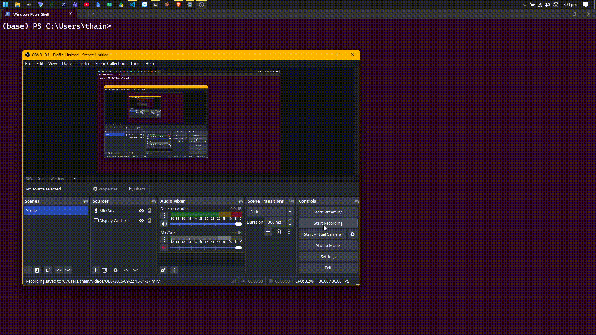

# Linked Open Data Application using Movie Knowledge Graph

## Set up environment

Use miniconda to set up the environment as follows:

```bash
conda create -n semantic-web python=3.14.7
conda activate semantic-web
pip install -r requirements.txt
```

## Collect data from TMDB

To crawl the data from https://www.themoviedb.org/,
create an account, get your API Key, store it in `.env`,
run:

```bash
python3 scripts/tmdb.py
```

Output: The generated files are written to `data/`. They include `movies.csv`,
`cast.csv`, `crew.csv`, entity lookup files such as `genres.csv` and
`companies.csv`, and relationship files such as `movie_genres.csv` and
`movie_companies.csv`.

## Transform CSV data into RDF

To transform table data into RDF triples (Turtle notation), run:

```bash
python3 scripts/transform.py
```

Output: `output/movies.ttl`

## Build an ontology using OWL

To enable deduction (ie making new facts using logic), we need to add
constraints on top of RDF triples using `ontology/ontology.owl`. Then, we use
the `owlrl` package for SPARQL reasoning.

Ontology: `ontology/ontology.owl` (manually written)

## Link entities with other sources

- Entity to link: intances of `schema:Movie`
- Linked knowledge graphs: DBpedia & Wikidata

Linking mechanism:
- Criteria: IMDB id, TMDB id, title, release year
- Scoring:
  - Automatically approved: (1) matches imdb, tmdb and year, and (2) can retrieve DBpedia URI
  - Rejected: due to year mismatch
  - Needs review: remaining cases

To start linking the Movie KG to Wikidata and DBpedia, run:

```bash
python3 scripts/link_movies.py
```

Output:
- `output/movie_links.ttl` - automatically approved entities
- `output/movie_candidates.csv` - rejects and need-review entities (for manual review and appending to the movie_links.ttl file)

## Query the Knowledge Graph via CLI

After generating `output/movies.ttl` and using `ontology/ontology.owl`, you can
run a SPARQL query from the provided examples in `queries/`.

```bash
python3 scripts/ask.py -q "queries/1.sparql"  # for Q1 -> Q10
python3 scripts/ask.py -q "queries/11.sparql" --reasoning  # for Q11 -> Q14
python3 scripts/ask.py --rdf "output/inferred_graph.ttl" -q "queries/11.sparql"  # for Q11 -> Q14 (faster)
python3 scripts/ask.py -q "queries/15.sparql" --target dbpedia  # for DBpedia remote querying
python3 scripts/ask.py -q "queries/15.sparql" --target wikidata  # for Wikidata remote querying
```

Reasoning is disabled by default. Add `--reasoning` when a query requires
OWL-RL inference.

⚠️ Known issue: Wikidata rate limit is expected.

| File (queries/) | Target question | Requires Deduction | KG Expressiveness |
| :---: | --- | :---: | :---: |
| 1.sparql | List 20 movies | o | ⭐ |
| 2.sparql | List 20 people | o | ⭐ |
| 3.sparql | List 20 directors | o | ⭐ |
| 4.sparql | List 5 actors for "Spider-Man: Brand New Day" the movie | o | ⭐ |
| 5.sparql | What is the basic information of "The Odyssey" the movie? | o | ⭐ |
| 6.sparql | List 20 highest-rated movies | o | ⭐⭐ |
| 7.sparql | List 20 highest-rated "Action" movies | o | ⭐⭐ |
| 8.sparql | List 20 highest-rated "Action" movies since 2020 | o | ⭐⭐ |
| 9.sparql | List 20 highest-rated "Action" movies since 2020 that starred Tom Holland | o | ⭐⭐ |
| 10.sparql | List 20 actors that have worked with Tom Holland in more than 1 movie | o | ⭐⭐ |
| 11.sparql | Which movies did this person direct? | x | ⭐⭐⭐ |
| 12.sparql | Which country is this movie's production company from? | x | ⭐⭐⭐ |
| 13.sparql | Does this movie have two different IMDb pages? | x | ⭐⭐⭐ |
| 14.sparql | Do these two movies share an IMDb page? | x | ⭐⭐⭐ |
| 15.sparql | What do we know about "The Odyssey" the movie from other sources (DBpedia or Wikidata)? | o | ⭐⭐⭐⭐ |

## Set up a SPARQL endpoint with Fuseki

Visit https://jena.apache.org/download/, download a file called `apache-jena-fuseki-6.2.0.zip`. Unzip it to `apache-jena-fuseki-6.2.0/`. Copy its absolute path and run:

```powershell
java --version  # Java 17+ is required
cd "<absolute path>"
fuseki-server
```

Go to `localhost:3030` via your browser. In the Fuseki UI, create a new dataset, upload dataset, and start querying.



⚠️ Fuseki doesn't have a reasoner by default, so load an inferred graph (like `output/inferred_graph_clean.ttl`) instead of the raw RDF file (like `output/movies.ttl`).

## Build and deploy the static knowledge-graph browser

The project includes a DBpedia-style static browser. It pre-generates resource
pages, an ontology browser, search data, and RDF/OWL downloads from the inferred
graph:

```bash
python3 scripts/build_site.py
```

The generated `_site/` directory is deployed automatically to GitHub Pages by
`.github/workflows/pages.yml`. Project-owned resource URIs are published under
`https://lam-thai-nguyen.github.io/Movie-Knowledge-Graph/resource/`; external
DBpedia, Wikidata, TMDB, IMDb, Schema.org, and RDF vocabulary URIs are left
unchanged. The source `example.org` RDF files remain available for local
reasoning and reproducible data generation.
